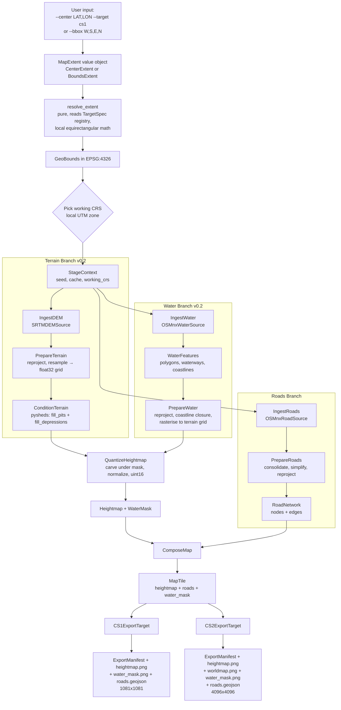

# cs2_map_generator — Architecture

A deterministic geospatial compiler that converts a real-world bounding box into a playable Cities: Skylines 1 (CS1) and Cities: Skylines II (CS2) map package.

The pipeline reads DEM tiles and OpenStreetMap features, projects them into a metric working CRS, transforms them through pure, inspectable stages, and emits engine-ready artifacts. Everything in this document is built to a single hard requirement: same inputs + same seed = byte-identical outputs.

---

## 1. MVP Scope (v0.1)

### In
- Two equivalent user-facing input shapes, translated to a single internal `GeoBounds` at the interface boundary (see ADR 0003):
  - **Center + radius** (natural CS UX): `--center LAT,LON [--radius-tiles N] --target cs1|cs2`. The centre tile is at the coordinate; the playable area extends `N` tiles in every cardinal direction. `N` defaults to the game-standard radius (CS1: 4, CS2: 10).
  - **Bounding box** (power-user / scripting): `--bbox west,south,east,north` in WGS84 lon/lat.
  Exactly one of the two must be provided.
- A `TargetSpec` registry in the domain captures per-game tile geometry (single source of truth for `tile_side_metres`, `grid_dimension`, `default_radius_tiles`).
- DEM acquisition via the `SRTMDEMSource` adapter (SRTM 30 m), cache-first. Source strategy: ESA STEP for MVP, NASA EarthData for production (ADR 0004).
- OSM road network acquisition via the `OSMnxRoadSource` adapter, filtered to drivable + arterial classes.
- Terrain pipeline: void-fill → reproject to working UTM → resample → normalize → write heightmap.
- Road pipeline: graph fetch → consolidate intersections → simplify → reproject → rasterize overlay (PNG mask) + GeoJSON export.
- Two export targets: `CS1ExportTarget` (1081×1081 16-bit PNG) and `CS2ExportTarget` (4096×4096 16-bit PNG + 4096×4096 world map PNG).
- Two surfaces wired to the same `Pipeline`:
  - CLI (`cs-mapgen generate --center ... --target cs1 --out ...` or `--bbox ...`).
  - FastAPI (`POST /maps`, synchronous, returns artifact manifest; body is a discriminated union over `{"kind": "center"}` and `{"kind": "bbox"}`).
- `FilesystemArtifactStore` dumps every stage's intermediate artifact for inspection (debuggability requirement).
- One golden-output regression test against a committed fixture bbox.

#### TargetSpec registry (v0.1)

| `target_id` | `tile_side_metres` | `grid_dimension` | `default_radius_tiles` | Map side (metres)        |
|-------------|--------------------|------------------|-------------------------|--------------------------|
| `cs1`       | 1920.0             | 9                | 4                       | 17 280 (9 × 1 920)       |
| `cs2`       | 623.3              | 21               | 10                      | 13 089 (21 × 623.3) [*]  |

[*] CS2 tile-side is community-measured; pinned with `TODO(adr-0003): verify CS2 tile-side metres` until an authoritative Colossal Order value is published.

### In (v0.2 — water layer)
- `OSMnxWaterSource` adapter via the `OSMWaterSource` port. Pulls `natural=water` polygons,
  `waterway={river,stream,canal}` lines, and `natural=coastline` lines. Cache-first.
- Hydrological conditioning: `ConditionTerrainStage` runs `pysheds.grid.Grid.fill_pits` and
  `fill_depressions` (Planchon-Darboux / Wang & Liu) on the float, working-CRS, target-grid
  elevation BEFORE quantisation.
- Coastline reconstruction: open OSM coastlines are clipped to the bbox and assembled into
  a sea `MultiPolygon` via `shapely.ops.polygonize` + left/right-of-line side test.
- `PrepareWaterStage` rasterises polygons + buffered waterways + sea polygon into a
  `WaterMask` aligned to the prepared terrain grid.
- `QuantizeHeightmapStage` carves heightmap pixels under the water mask to
  `sea_level_metres - epsilon` and then quantises to uint16.
- CS1/CS2 export bundles gain `water_mask.png` (uint8 0/255 grayscale, 1:1 with the
  heightmap). Manifest `schema_version` is bumped to 2.

### Out (deferred)
- Forests, land-use, zoning suggestions (v0.3).
- Procedural noise augmentation, erosion simulation (v0.3+).
- Railways, transit overlays.
- Async job queue, multi-bbox batches, GPU acceleration.
- Live Overpass queries during tests (network-isolated tests only).
- CS2 binary map package; v0.1/v0.2 emit only the documented PNG layers + a manifest. Binary packaging is tracked in `docs/adr/0002-cs2-export-format.md`.
- CS2 separate `water_depth.png` channel — pending Q1 in `docs/adr/0005-water-mask-and-carving.md`.
- River networks as graph-like `RiverNetwork` objects (deferred until flow accumulation
  earns its keep in v0.3+).

---

## 2. Phase-by-Phase Roadmap

### v0.1 — MVP (terrain + roads)
- `SRTMDEMSource` with public-mirror fetch + on-disk cache (content-addressed).
- `OSMnxRoadSource` with class allowlist.
- Terrain stage: void-fill, reproject (bilinear), normalize to height scale, quantize to uint16.
- Road stage: fetch graph, `consolidate_intersections`, `simplify_graph`, rasterize to mask.
- `CS1ExportTarget` and `CS2ExportTarget` PNG writers + `manifest.json`.
- CLI (typer) and FastAPI surfaces hitting the same `Pipeline`.
- Golden-output determinism test (SHA-256 over output PNG bytes).

### v0.2 — Water + coastlines (SHIPPED)
- `OSMWaterSource` port + `OSMnxWaterSource` adapter (`natural=water` polygons,
  `waterway={river,stream,canal}` lines, `natural=coastline` lines).
- Coastline reconstruction (bbox closure via shapely `polygonize` + left/right side test).
- `WaterMask` value object (binary raster aligned to heightmap grid), `WaterFeatures` DTO,
  `WaterPolygon` / `Waterway` / `CoastlineSegment` domain types in `cs_mapgen.domain.water`.
- Hydrological conditioning via `pysheds.grid.Grid.fill_pits` + `fill_depressions`
  (Planchon-Darboux / Wang & Liu) before quantisation.
- Pipeline restructure: `PrepareTerrain` now produces float `PreparedTerrain`;
  `ConditionTerrain` and `PrepareWater` slot in between it and the new `QuantizeHeightmap`.
- Water plane integration into CS1/CS2 export: heightmap pixels carved to
  `sea_level - epsilon`; separate `water_mask.png` artifact emitted (uint8 grayscale).
- Manifest `schema_version` bumped to 2.

### v0.3 — Forests + land-use
- `OSMLandUseSource` (forest, residential, industrial, commercial, farmland).
- `VegetationMask` rasterization + density heuristic (slope × moisture proxy).
- `LandUseMap` value object as a categorical raster.
- Procedural fill (OpenSimplex) for sub-DEM-resolution forest variation — augment only, never replace real geometry.
- CS1/CS2 surface overlay export.

### v0.4 — Playability heuristics + game-constraint adaptation
- Slope analysis → flag unbuildable cells; soft-blur excessive slopes (clamped to CS1's 1024 m ceiling).
- Height-range compression strategy when real relief exceeds engine capacity.
- Road-density heuristic → zoning suggestion overlays (advisory, not authoritative).
- Game-tile-aware bbox snapping (avoid features that fall on tile seams).

### v1.0 — Commercial-grade creator tool
- Pluggable DEM sources (Copernicus GLO-30, USGS 3DEP, ALOS) selectable per region.
- Tile-based parallelism for very large bboxes (`dask`/`ProcessPoolExecutor`).
- GPU raster ops (CuPy/Taichi) for erosion + flow accumulation hot paths.
- Versioned manifest (schema-versioned, signed) for reproducibility audits.
- Optional headless preview renderer (hillshade + road overlay → preview PNG).
- Plug-in registry for community-contributed stages.

---

## 3. Repository Structure

```
cs2_map_generator/
├── .devcontainer/
│   ├── devcontainer.json              # VS Code dev container definition
│   └── Dockerfile                     # GDAL base + uv + project deps
├── .github/
│   └── workflows/
│       └── ci.yml                     # ruff, mypy, pytest (placeholder, not auto-run)
├── docs/
│   ├── ARCHITECTURE.md                # this file
│   └── adr/
│       ├── 0001-pipeline-architecture.md
│       └── 0002-cs2-export-format.md
├── src/cs_mapgen/
│   ├── __init__.py                    # package metadata, version
│   ├── domain/                        # zero framework deps, pure data
│   │   ├── __init__.py
│   │   ├── geometry.py                # GeoBounds, Projection
│   │   ├── raster.py                  # DEMTile, Heightmap, WaterMask, VegetationMask, LandUseMap
│   │   ├── network.py                 # RoadNetwork (graph value object)
│   │   ├── map_tile.py                # MapTile (composed game-ready artifact)
│   │   └── manifest.py                # ExportManifest
│   ├── application/                   # use cases / pipeline orchestration
│   │   ├── __init__.py
│   │   ├── stage.py                   # Stage Protocol, StageContext, StageResult
│   │   ├── pipeline.py                # Pipeline, PipelineBuilder
│   │   ├── ports.py                   # DEMSource, OSMSource, Reprojector, ArtifactStore, ExportTarget Protocols
│   │   └── stages/                    # concrete stages (pure, no I/O)
│   │       ├── __init__.py
│   │       ├── ingest_dem.py
│   │       ├── ingest_roads.py
│   │       ├── prepare_terrain.py
│   │       ├── prepare_roads.py
│   │       └── compose_map.py
│   ├── infrastructure/                # all side effects live here
│   │   ├── __init__.py
│   │   ├── dem/
│   │   │   ├── __init__.py
│   │   │   ├── srtm_source.py         # SRTMDEMSource (cache-first, httpx fetch)
│   │   │   └── tile_index.py          # SRTM tile naming math
│   │   ├── osm/
│   │   │   ├── __init__.py
│   │   │   └── osmnx_road_source.py   # OSMnxRoadSource
│   │   ├── projection/
│   │   │   ├── __init__.py
│   │   │   └── pyproj_reprojector.py  # PyprojReprojector + UTM zone picker
│   │   ├── artifact_store/
│   │   │   ├── __init__.py
│   │   │   └── filesystem.py          # FilesystemArtifactStore
│   │   └── export/
│   │       ├── __init__.py
│   │       ├── cs1.py                 # CS1ExportTarget (1081×1081, 16-bit PNG)
│   │       └── cs2.py                 # CS2ExportTarget (4096×4096, 16-bit PNG + world map)
│   ├── interfaces/                    # entry points, no business logic
│   │   ├── __init__.py
│   │   ├── cli/
│   │   │   ├── __init__.py
│   │   │   └── app.py                 # typer app + cs-mapgen entry point
│   │   └── http/
│   │       ├── __init__.py
│   │       ├── app.py                 # FastAPI app factory
│   │       ├── routers.py             # /maps, /healthz
│   │       └── schemas.py             # Pydantic request/response models
│   └── config/
│       ├── __init__.py
│       └── settings.py                # pydantic-settings (env-driven)
├── tests/                             # mirrors src layout
│   ├── __init__.py
│   ├── conftest.py
│   ├── fixtures/
│   │   ├── README.md
│   │   ├── tiny_bbox.json             # fixture bbox metadata
│   │   └── srtm_cache/                # tiny DEM tiles for offline tests
│   ├── domain/
│   │   ├── test_geometry.py
│   │   └── test_raster.py
│   ├── application/
│   │   ├── test_pipeline.py
│   │   └── test_stage_context.py
│   ├── infrastructure/
│   │   ├── test_srtm_source_cache.py
│   │   └── test_filesystem_artifact_store.py
│   ├── interfaces/
│   │   ├── test_cli.py
│   │   └── test_http.py
│   └── golden/
│       └── test_full_pipeline_determinism.py
├── data/
│   ├── cache/                         # gitignored, runtime DEM/OSM cache
│   └── README.md
├── .editorconfig
├── .gitignore
├── .python-version
├── LICENSE
├── README.md
└── pyproject.toml
```

---

## 4. Data Models

All domain types live in `src/cs_mapgen/domain/`. Zero infrastructure imports. Value objects are `frozen=True` dataclasses. Types carrying numpy arrays are also frozen at the wrapper level — the array itself is conventionally not mutated downstream; stages either return a new array or copy on write.

| Type | Kind | Carries | Mutability | Notes |
|---|---|---|---|---|
| `GeoBounds` | value object | `west, south, east, north` floats + `crs: Projection` | frozen | Validates ordering and finite values at construction. |
| `Projection` | value object | `epsg: int`, `description: str` | frozen | Wraps EPSG codes; integrates with pyproj at the infrastructure boundary, never inside the domain. |
| `DEMTile` | value object + ndarray | `elevation: NDArray[float32]`, `transform: tuple[float, ...]` (affine), `crs: Projection`, `nodata: float`, `provider: str`, `resolution_metres: float` | frozen wrapper | Affine stored as a 6-tuple so domain remains independent of rasterio. |
| `Heightmap` | value object + ndarray | `pixels: NDArray[uint16]`, `width: int`, `height: int`, `height_scale_metres: float`, `sea_level_metres: float`, `bounds: GeoBounds` | frozen wrapper | The final terrain artifact pre-export. Always uint16 grayscale. |
| `RoadNetwork` | value object | `nodes: tuple[RoadNode, ...]`, `edges: tuple[RoadEdge, ...]`, `crs: Projection` | frozen | Tuples not networkx graphs — keeps domain framework-free. Conversion to/from networkx lives in infrastructure. |
| `RoadNode` | value object | `node_id: int`, `x: float`, `y: float` | frozen | Coordinates in `crs.epsg`. |
| `RoadEdge` | value object | `source: int`, `target: int`, `geometry: tuple[tuple[float, float], ...]`, `highway_class: str`, `length_metres: float` | frozen | Geometry as a coordinate tuple, not a shapely object, to keep the domain pure. |
| `WaterMask` | value object + ndarray | `mask: NDArray[bool]`, `transform: tuple[float, ...]`, `crs: Projection` | frozen wrapper | v0.2. |
| `VegetationMask` | value object + ndarray | `density: NDArray[float32]`, `transform`, `crs` | frozen wrapper | v0.3. Density 0..1. |
| `LandUseMap` | value object + ndarray | `categories: NDArray[uint8]`, `legend: tuple[tuple[int, str], ...]`, `transform`, `crs` | frozen wrapper | v0.3. |
| `MapTile` | aggregate value object | `heightmap: Heightmap`, `road_network: RoadNetwork`, `water_mask: WaterMask \| None`, `vegetation_mask: VegetationMask \| None`, `land_use: LandUseMap \| None`, `bounds: GeoBounds`, `target_id: str` | frozen | The composed, export-ready map. Optional fields are populated as later phases land. |
| `ExportManifest` | value object | `target: str`, `bounds: GeoBounds`, `inputs_hash: str`, `seed: int`, `artifacts: tuple[ArtifactEntry, ...]`, `created_at_utc: str` | frozen | Serializable to JSON; the reproducibility contract. |
| `ArtifactEntry` | value object | `name: str`, `path: str`, `sha256: str`, `mime: str` | frozen | One line per exported file. |

**Determinism note**: All collections inside frozen objects are `tuple`, never `list`/`dict`. Where dict-shaped data is unavoidable (e.g. tags), serialize via sorted key tuples.

---

## 5. Pipeline Interfaces

### Protocols

```python
# src/cs_mapgen/application/stage.py

class Stage[InputT, OutputT](Protocol):
    name: str
    def run(self, inputs: InputT, context: StageContext) -> OutputT: ...
```

```python
# src/cs_mapgen/application/ports.py

class DEMSource(Protocol):
    def fetch(self, bounds: GeoBounds, context: StageContext) -> DEMTile: ...

class OSMSource(Protocol):
    def fetch_roads(self, bounds: GeoBounds, network_type: str, context: StageContext) -> RoadNetwork: ...

class Reprojector(Protocol):
    def reproject_raster(self, tile: DEMTile, target: Projection, resampling: str) -> DEMTile: ...
    def reproject_network(self, network: RoadNetwork, target: Projection) -> RoadNetwork: ...

class ArtifactStore(Protocol):
    def write(self, name: str, payload: bytes, context: StageContext) -> ArtifactEntry: ...
    def write_intermediate(self, stage_name: str, artifact_name: str, payload: bytes, context: StageContext) -> ArtifactEntry: ...

class ExportTarget(Protocol):
    target_id: str
    def export(self, tile: MapTile, store: ArtifactStore, context: StageContext) -> ExportManifest: ...
```

### StageContext

```python
@dataclass(frozen=True)
class StageContext:
    bounds: GeoBounds
    working_crs: Projection
    seed: int
    cache_directory: Path
    output_directory: Path
    dump_intermediates: bool
    logger: Logger
    rng: numpy.random.Generator   # built from `seed`, never `random` global
```

`StageContext` is immutable per pipeline run. Stages never reach for globals — anything they need is either in their `inputs` or on `context`.

### Pipeline + PipelineBuilder

```python
class Pipeline:
    def __init__(self, stages: tuple[Stage, ...]) -> None: ...
    def run(self, initial_input: object, context: StageContext) -> object: ...

class PipelineBuilder:
    def with_dem_source(self, source: DEMSource) -> PipelineBuilder: ...
    def with_osm_source(self, source: OSMSource) -> PipelineBuilder: ...
    def with_reprojector(self, reprojector: Reprojector) -> PipelineBuilder: ...
    def with_export_target(self, target: ExportTarget) -> PipelineBuilder: ...
    def with_artifact_store(self, store: ArtifactStore) -> PipelineBuilder: ...
    def build_terrain_and_roads(self) -> Pipeline: ...
```

The builder wires stages by injecting ports. Stages declare what they need via constructor injection — no service locators, no globals.

---

## 6. Data Flow

The CLI / HTTP boundary accepts either a `CenterExtent(center, radius_tiles, target_id)` or a `BoundsExtent(bounds)` and resolves it to a `GeoBounds` via the pure `resolve_extent` function before any pipeline stage runs. Everything below the dashed line is unchanged from the original bbox-only pipeline.



The two branches are logically parallel and share only the immutable `StageContext`. In v0.1 they run sequentially in the same process for simplicity; the architecture does not preclude `ProcessPoolExecutor` parallelism in v1.0 because each branch consumes only frozen inputs.

The translation of `CenterExtent` → `GeoBounds` is **deterministic**: same `(lat, lon, radius_tiles, target_id)` always yields the same `GeoBounds`. The golden-output test therefore covers both input shapes simultaneously — passing a `--center` whose resolution matches a `--bbox` produces byte-identical artifacts (this property is asserted in `tests/interfaces/test_cli.py`).

---

## 7. Core Algorithms (MVP)

| Stage | Algorithm | Library function | Notes |
|---|---|---|---|
| DEM void filling | inverse-distance interpolation over `nodata` mask | `scipy.ndimage.distance_transform_edt` + manual fill, or `rasterio.fill.fillnodata` | `fillnodata` is good enough for MVP; mark for review if seams appear. |
| DEM reprojection | bilinear resampling to working UTM | `rasterio.warp.reproject(..., resampling=Resampling.bilinear)` | Bilinear chosen over cubic — cubic overshoots on steep slopes and can introduce negative elevations near coastlines. |
| DEM downsample to target grid | bilinear | `rasterio.warp.reproject` again | One reprojection step combines CRS change + grid alignment. |
| Heightmap normalization | linear stretch from real elevation range to `[0, height_scale_metres]`, then quantize to uint16 | NumPy | Configurable: clip vs. compress when real range > engine cap (1024 m CS1). MVP clips and logs a warning. |
| OSM graph fetch | bbox query, network_type filter | `osmnx.graph.graph_from_bbox` (OSMnx 2.x signature) | Cache the raw GraphML to disk keyed by `(bbox, network_type, osmnx_version)`. |
| Intersection consolidation | spatial clustering | `osmnx.simplification.consolidate_intersections(tolerance_metres=10)` | Tolerance in metres — requires the graph already projected to the working CRS. |
| Graph simplification | topology simplification (remove non-junction interstitial nodes) | `osmnx.simplification.simplify_graph` | Run before consolidation? OSMnx convention: simplify, then consolidate, then simplify again. Document choice in stage. |
| Road class filtering | tag allowlist on `highway` attribute | pure Python over edges | Allowlist: `motorway, trunk, primary, secondary, tertiary, residential, unclassified`. |
| Road rasterization (overlay) | line buffer + raster burn | `rasterio.features.rasterize` over shapely LineStrings buffered by class-specific width | Width per class in metres → pixel width derived from heightmap resolution. |
| CS1 export | crop to 17.28 km square, resample to 1081×1081, normalize to uint16, write PNG | `rasterio.warp.reproject` + `pillow.Image.fromarray` | PNG via Pillow with `mode="I;16"`. |
| CS2 export | resample to 4096×4096, write PNG + 4096×4096 world map whose center 1024×1024 matches base | `pillow.Image.fromarray` | World map padding strategy: replicate-edge sampling beyond the bbox until v0.4 brings real wide-context DEM fetch. `[RESEARCH]` how CS2 expects sea-level offsets in the world map. |
| Determinism guard | inputs hash | SHA-256 over canonical JSON of `(bounds, seed, source versions, stage versions)` | Stored in `ExportManifest.inputs_hash`. v0.2 extends the payload with `water_mask_sha256`. |
| Hydrological conditioning (v0.2) | Wang & Liu / Planchon-Darboux pit + depression fill | `pysheds.grid.Grid.fill_pits` then `fill_depressions` | Run on the float, working-CRS, target-grid elevation BEFORE quantisation. Pinned to `pysheds~=0.5`. Documented in ADR 0005. |
| OSM water polygons (v0.2) | `natural=water` polygons via OSMnx features API | `osmnx.features.features_from_bbox(bbox=..., tags={"natural": ["water"]})` | Rasterised straight to the water mask with `all_touched=True`. |
| OSM waterways (v0.2) | `waterway=river\|stream\|canal` lines | Same OSMnx call with class-filtered tags | Buffered by class width (river 20 m, stream 5 m, canal 15 m) then burned. Other classes skipped. Documented in ADR 0005. |
| Coastline reconstruction (v0.2) | clip-then-polygonize closure | `shapely.ops.polygonize` over (clipped coastline ∪ bbox boundary) | Sea polygons selected by right-of-line side test per the OSM "land on left" convention. Antimeridian / polar bboxes raise `InvalidBoundsError`. Documented in ADR 0005. |
| Water carving (v0.2) | clamp-under-mask | NumPy boolean indexing | `pixel = sea_level - height_scale/65535` only where `mask=True` AND `elevation > sea_level`. Preserves natural sub-sea-level bathymetry. |
| Procedural sub-pixel variation (v0.3) | OpenSimplex 2D noise + domain warping | `opensimplex` | Seeded from `StageContext.seed`. Augment only; never overwrite DEM where data exists. |

---

## 8. Risks and Technical Challenges

| # | Risk | L | I | Mitigation |
|---|---|---|---|---|
| 1 | GDAL install pain across host platforms (macOS/Windows/Linux variance, version-skew between gdal-bin and python bindings). | H | H | Dev Container is mandatory; pin a single `ghcr.io/osgeo/gdal` digest; install rasterio/geopandas via `uv` on top inside the container; document "no host installs" policy in README. |
| 2 | Projection edge cases at the antimeridian (bbox crossing ±180°) and at the poles (UTM zones break above 84°N / below 80°S). | M | H | Validate bbox at the domain boundary; refuse bboxes crossing the antimeridian in v0.1 (raise `InvalidBoundsError`); fall back to UPS for polar bboxes in a later phase, log + fail in v0.1. |
| 3 | CS2 export format is partially undocumented (binary asset layout, world-map sea-level semantics). | M | H | Emit only the documented PNG layers + a manifest in v0.1; track open questions in `docs/adr/0002-cs2-export-format.md`; mark uncertain pieces with `TODO(adr-0002)`. |
| 4 | Road network simplification destroys intersections that the engine needs to render as proper junctions. | M | M | Run `consolidate_intersections` with documented metre tolerance (10 m), then `simplify_graph`; dump pre/post graphs as intermediate artifacts; cover with regression test that asserts intersection count stays within tolerance band. |
| 5 | SRTM tile boundary seams produce visible elevation discontinuities in the output heightmap. | M | M | Fetch one extra tile of padding around the bbox; mosaic before any per-pixel operation; cover with a fixture that intentionally straddles a tile boundary. |
| 6 | Determinism leaks (unsorted dict iteration, unseeded RNG, parallel float reduction order). | M | H | Forbid `random` module globals (lint rule); all NumPy RNGs derive from `StageContext.seed`; sort all dict-derived iteration that affects output; golden-output test in CI enforces SHA-256 stability. |
| 7 | Memory blowup on large bboxes (a 100 km × 100 km region at 30 m resolution = ~11M elevation samples, manageable; but with intermediate float64 arrays and reprojection scratch buffers it can hit several GB). | M | M | Stream reprojection through `rasterio` windowed reads; use `float32` not `float64` for elevation; cap v0.1 bbox area at a configurable maximum and refuse larger requests with a clear error. |
| 8 | Licensing on OSM data redistribution (ODbL attribution clause) and SRTM (NASA public domain in the US, attribution recommended). | M | M | Document attribution requirements in `ExportManifest` and `README`; emit a `LICENSE.txt` alongside every output bundle pointing at OSM/SRTM attribution; never re-host raw OSM extracts. |
| 9 | OSMnx API drift (`graph_from_bbox` signature changed in 2.0; future minor releases may shift defaults). | M | M | Pin OSMnx with `~=` to a minor release; wrap all OSMnx calls inside `OSMnxRoadSource` so an upstream change touches one file; cover the wrapper with a contract test. |
| 10 | Height range overflow — real relief exceeds CS1's 1024 m ceiling (Alps, Himalayas, etc.). | M | M | Clip with explicit warning in v0.1; offer compression mode (linear stretch to engine cap) in v0.4; record decision in `ExportManifest`. |
| 11 | Float precision in geometry equality / topology cleaning (shapely 2.x snap-rounding interactions). | L | M | Use `shapely.set_precision` deliberately; never compare floats with `==`; cover with property tests in v0.3+. |
| 12 | pysheds licence is GPL-3 (v0.2 dependency). Linking-only / library use is fine for an MIT pipeline; redistribution of pysheds itself in a commercial bundle would propagate GPL-3. | M | M | Document in ADR 0005; re-verify before any commercial redistribution that bundles pysheds. |

---

## 9. Recommended Libraries

| Library | Role | Version pin | License | Why this one |
|---|---|---|---|---|
| `gdal` (system) | C library, raster/vector primitives | `==` to image digest | MIT/X | Source of truth, fixed by base image. |
| `rasterio` | Pythonic raster I/O + reprojection | `~=1.4` | BSD-3 | Idiomatic; preferred over raw GDAL bindings; stable API. |
| `geopandas` | Vector dataframes | `~=1.0` | BSD-3 | Standard for vector wrangling; shapely 2.x integration. |
| `shapely` | Geometry primitives | `~=2.0` | BSD-3 | Vectorized 2.x API is non-negotiable for performance. |
| `pyproj` | CRS + transforms | `~=3.7` | MIT | Always `always_xy=True`; correct datum handling. |
| `osmnx` | OSM road graph fetch | `~=2.1` | MIT | Pinning to 2.x because 2.0 changed `graph_from_bbox` signature. |
| `networkx` | Graph algorithms | `~=3.4` | BSD-3 | Required transitively by OSMnx; we use it directly for path metrics. |
| `numpy` | Arrays | `~=2.1` | BSD-3 | Foundation. |
| `scipy` | ndimage, sparse | `~=1.14` | BSD-3 | For void filling, smoothing, distance transforms. |
| `scikit-image` | image-domain raster ops | `~=0.24` | BSD-3 | Morphology, edge-preserving filters; complements scipy. |
| `pillow` | PNG read/write incl. 16-bit | `~=11.0` | HPND | Cleanest path to 16-bit grayscale PNG output. |
| `pydantic` | Domain DTO validation + FastAPI bodies | `~=2.9` | MIT | Used at the interfaces layer; **not** in the domain. |
| `pydantic-settings` | Env-driven config | `~=2.6` | MIT | Validates env at startup. |
| `typer` | CLI framework | `~=0.13` | MIT | Picked over `click`: full type-annotation-driven UX, less boilerplate, same Click engine underneath. |
| `fastapi` | HTTP surface | `~=0.115` | MIT | Standard, OpenAPI free, Pydantic integration. |
| `uvicorn` | ASGI server | `~=0.32` | BSD-3 | Default for FastAPI. |
| `httpx` | Async HTTP client | `~=0.27` | BSD-3 | For SRTM fetches; supports sync+async, retries via transports. |
| `opensimplex` | Deterministic 2D noise | `~=0.4` | MIT | For v0.3+; `noise` package is unmaintained. |
| `pysheds` | Hydrological conditioning (pit + depression fill) | `~=0.5` | GPL-3 | v0.2. Numba-accelerated Planchon-Darboux / Wang & Liu. See ADR 0005. The GPL-3 licence applies to derivative redistribution of pysheds itself; we use it as a library call within an MIT-licensed pipeline, which is the standard interaction. Re-verify implications before any commercial-grade redistribution. |
| `affine` | 6-tuple affine objects compatible with rasterio / pysheds | `~=2.4` | BSD-3 | v0.2. Already a transitive dep via rasterio; pinned directly here to make the pysheds-feeding code path obvious. |
| `pytest` | Test runner | `~=8.3` | MIT | |
| `pytest-asyncio` | async tests | `~=0.24` | Apache-2.0 | FastAPI handlers under test. |
| `httpx` (test) | client for FastAPI testing | shared with above | | Use `ASGITransport` for in-process tests. |
| `ruff` | Lint + format | `~=0.7` | MIT | One tool, replaces flake8/black/isort. |
| `mypy` | Type checker | `~=1.13` | MIT | `--strict` mode in CI. |
| `coverage` | Coverage | `~=7.6` | Apache-2.0 | |
| `uv` | Dependency manager | latest | MIT/Apache-2.0 | Lockfile, fast. |

---

## 10. Testing Methodology

| Layer | Style | Notes |
|---|---|---|
| Domain | Pure-function unit tests | `GeoBounds` rejects invalid ordering, `Heightmap` rejects non-uint16, `RoadEdge` enforces non-empty geometry. |
| Application | Pipeline orchestrator + stage Protocol | Test `Pipeline.run` with two **fake** stages: assert call ordering, context propagation, immutability of context, deterministic re-run. |
| Infrastructure (ports) | Contract tests against the Protocol | `SRTMDEMSource` cache-hit path uses a fixture tile committed under `tests/fixtures/srtm_cache/`. Cache-miss path is **not** tested with live network; it is covered by injecting a fake `httpx.Client` transport. |
| Interfaces — CLI | `typer.testing.CliRunner` | `cs-mapgen --version`, `cs-mapgen generate --bbox ... --target cs1 --out tmp/` happy path. Uses a fake `Pipeline` injected via DI. |
| Interfaces — HTTP | `httpx.AsyncClient` + `ASGITransport` | `GET /healthz`, `POST /maps` with a fake pipeline. Asserts schema, status codes, OpenAPI emission. |
| Golden output | SHA-256 of `heightmap.png`, `water_mask.png`, and `manifest.json` bytes | The determinism contract. The v0.2 fixture bbox exercises the water branch via a hand-crafted offline `WaterFeatures` (committed under `tests/fixtures/water/`); the cached synthetic SRTM tiles are still built at fixture-setup time. Test runs `xfail` until the first successful run records a baseline; on baseline-recording, the new digests replace the placeholders in `tests/golden/test_full_pipeline_determinism.py`. |
| Property-based (v0.3+) | Hypothesis | Geometry/topology invariants. Not in v0.1. |

v0.2 fixtures (`tests/fixtures/water/`):
- `tiny_water.json` — a small offline water fixture (a single polygon, one waterway, one
  coastline) for the bbox already used by `tests/conftest.py::fixture_bbox`. Committed,
  provenance documented in `tests/fixtures/README.md`. No live OSM is touched.

**No mocking of GDAL/rasterio internals.** Tests use small real artifacts. Network is forbidden at test time — pytest is configured to fail loudly if a test attempts to hit the network (custom `conftest.py` guard).

---

## 11. Long-Term Scalability

When this becomes a commercial creator tool:

- **Tile-based parallelism**. Pipeline stages are pure over frozen inputs — a `ProcessPoolExecutor` (CPU-bound) or `dask` cluster can fan out by sub-tile of a large bbox without API changes.
- **Content-addressed cache**. DEM tiles are immutable (SRTM revisions are explicit). The cache key is `(provider, version, tile_id)`; the cache is safe to share across users and CI workers.
- **Pluggable export targets**. `ExportTarget` is a Protocol with two implementations today. CS3, Unity Terrain, Unreal Landscape can slot in without touching the domain or application layers.
- **GPU acceleration**. `numpy` arrays inside `Heightmap` and friends are trivially `cupy.ndarray`-compatible at the call site; erosion and flow-accumulation kernels are the obvious GPU candidates.
- **Distributed orchestration**. The `Pipeline` orchestrator stays in-process; if scale demands it, wrap the pipeline as a Prefect/Dagster task — **never** in MVP.
- **Versioned manifest**. `ExportManifest` includes `schema_version`; a future v2 manifest carries signed provenance and supersedes-links. Backward read is the contract.
- **Telemetry**. Off by default. When on, structured logs + OTLP traces; never includes user paths or API keys; respects `CS_MAPGEN_TELEMETRY=off`.
- **Plugin registry**. v1.0+: third-party stages register via Python entry points (`cs_mapgen.stages`); the builder discovers them lazily.
- **Multi-tenant cache** (commercial deployment): content-addressed cache lives in S3/GCS behind the same `ArtifactStore` Protocol; no API change in the application layer.

---

## Appendix A — Heightmap target specifications (verified)

- **CS1**: 1081 × 1081 pixels, 16-bit grayscale PNG or RAW; map side = 17.28 km; one pixel ≈ 16 m; full grayscale range maps to 0–1024 m of relief by default; sea level at ~40 m. (The brief's "18-bit" wording is treated as a typo for 16-bit.)
- **CS2**: 4096 × 4096 pixels, 16-bit grayscale PNG or TIFF; world map is also 4096 × 4096, and its center 1024 × 1024 region must match the base heightmap pixel-for-pixel.
